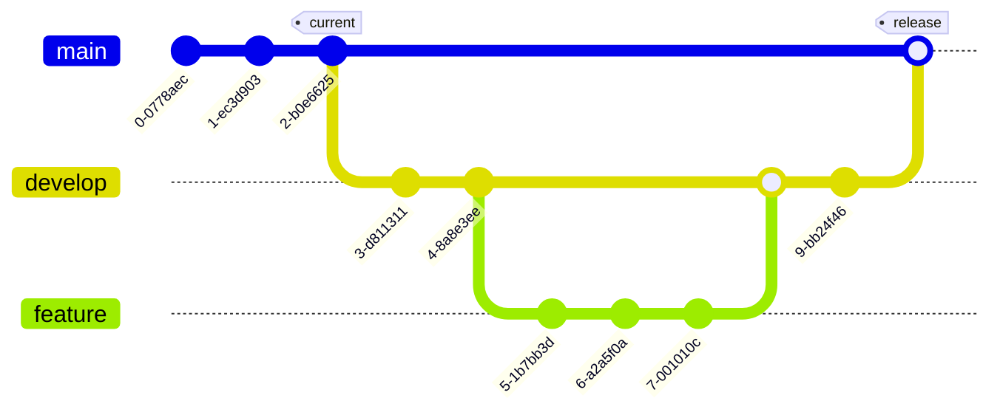

# Best Practices

## Use Merge

In general refrain from using `git rebase` at all times. There are a few notable exceptions that will be described below, but, unless there's a specific need for it avoid `rebase`.

`git rebase` rewrites the Git history. This is both dangerous and lessens the value of using versioning software. 

While using `git merge` can seem daunting at times, especially when there are large conflicts, restricting the use of `rebase` will allow for git to naturally resolve the conflicts through a clearer view of git history.

If desired, there are a several excellent GUI tools to aide in `git diff` conflict resolution. 

### Exceptions

Using `git rebase` on your own local branches, prior to being shared, typically does not create any git history problems. The problems typically originate once the versioning is distributed to multiple collaborators.

An example of this would be GitHub's `Squash and Merge` action for Pull Requests. This takes all of the branches commits and rebases them into the destination branch as a single commit. 

Note: Once doing this any children branches of the recently squashed branch will now have conflicts for all commits in the branch that it originated from.


# Branching

## Key Takeaways

- Keep `main` stable
- Use `develop` for day-to-day main-line
- Create `feature/` branch for new work
- Open PR's from `feature/` branches to `develop`
- When `develop` is ready, PR to `main`
- Create a new `tag` prior to releasing

## Branching

### Main (`main`)
The `main`  branch is reserved for the latest stable version of the application. This branch is protected and SHOULD NOT receive direct commits, only merges through the Pull Request process.

### Development (`develop`)
To assist with integration testing and development, the `develop` branch stability is not guaranteed. Like the `main` line the primary method of contribution should be done through the Pull Request process.

### Feature Branching

Feature Branching is a strategy that involves creating a separate branch for each new feature, enhancement, or significant change. 

Implementing this strategy is a simple as following a prescribed git workflow:

1. Checkout the origin branch.
	> ```shell
	> git checkout develop
	> git pull
	> ```
2. Create your new feature branch
	> ```shell
	> git checkout -b feature/ENO-123-add-tacos
	> ```
3. Make your changes, then commit them
	> List your changes, if anything was unintentional either revert (`git checkout -- <filename>`) or `git stash`
	> ```shell
	> git status 
	> ```
	> 
	> If needed, add files to git tracking
	> ```sh
	> git add my/new/model.py
	> ```
	> 
	> Inspect your changes
	> ```
	> git diff
	> ```
	> 
	> Commit them to your branch
	> ```sh
	> git commit -am "Added new model: Tacos. Clarified how excessive cheese toppings are detected."
	> ```
4. When you're done with your commits, push them up:
	> ```shell
	> git push -u origin feature/ENO-123-add-tacos
	> ```

#### Diagram 



